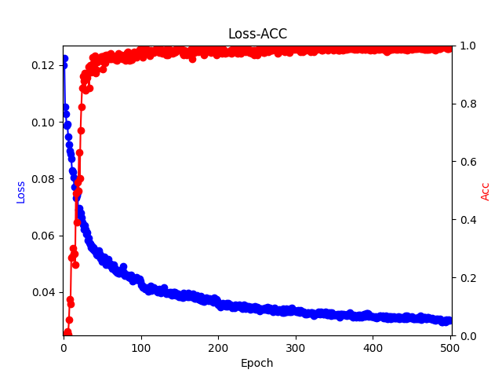
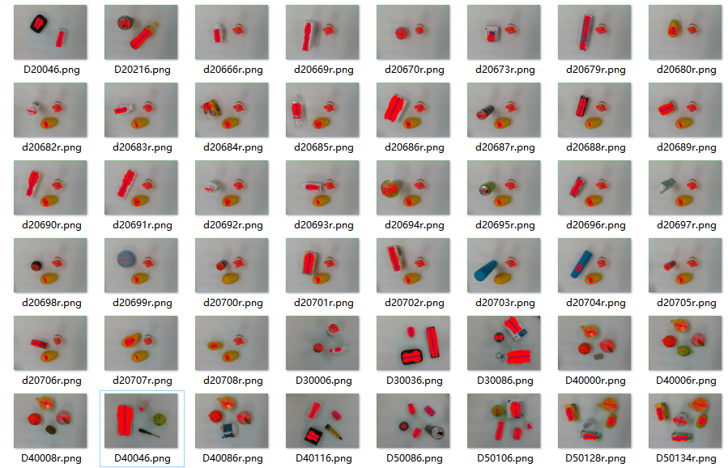

## RCN_Net：Rapid Convergence Neural Network in pytorch
---

## Contents
1. [Performance](#性能情况)
2. [Environment](#所需环境)
3. [Download](#文件下载)
4. [How2train&predict](#训练步骤)
5. [Reference](#Reference)

## Top News
**`2025-03`**:**Support step, cos learning rate decline method, support the selection of many optimizers such as adam, sgd and adan, support the adaptive adjustment of learning rate according to batch_size, and add new image cropping.**


## Performance
| method  |    dataset     |  image  |  Img  |  Obj  | speed(fps)|
|:-------:|:--------------:|:-------:|:-----:|:-----:|:----:|
| [4]2022 | Conell dataset | 480x640 | 98.2  | 97.1  | 40
| [5]2023 | Conell dataset | 480x640 | 97.7  |       | 4.5
| [3]2023 | Conell dataset | 480x640 | 97.2  | 96.4  | 40.6
| [2]2023 | Conell dataset | 480x640 | 98.9  | 97.1  | 24
| [6]2023 | Conell dataset | 480x640 | 98.9  | 98.3  | 9.6
| [1]2022 | Conell dataset | 480x640 | 99.09 | 98.64 | 66.7
| [7]2024 | Conell dataset | 480x640 | 98.9  |       |
|  ours   | Conell dataset | 480x640 | 99.99 | 99.06 | 88

Img means to evaluate the ability of the network to recognize objects in different positions and directions in the image, and Obj is to evaluate the ability of the network to recognize different objects in the image.
## Environment
    - torch==1.10.0+cu111
    - torchaudio==0.10.0+rocm4.1
    - torchsummary==1.5.1
    - torchvision==0.11.0+cu111
    - tensorboardx==2.5.1
    - opencv-python==4.6.0.66
    - numpy=1.19.2

## Download

The download address of MTGD_neu data set is as follows, which already includes training set, test set and verification set (the same as test set), so it is unnecessary to divide it again:
https://github.com/Xuejiao-Zhang/MTGD_neu.

## How2train
### a、Train MTGD_neu data set 
1. Prepare dataset

Before training, you need to download the data set of MTGD_neu, decompress it and put it in the root directory data_set.**  

2. Dataset process

Modify the txt files in the three files in the /data_set/train-test folder, and divide the training set and test set of single target, multi-target or all targets according to your own needs.
Run the following command to generate the dataset index file, so as to load the dataset more quickly.
```python
cd Clutter-Grasp-Dataset-main
python generate_grasp_mat.py
```

3. Train  

Run the following code to train madel.
```python
python train_net.py
```
Our training results are as follows:


4. Visual verification of training results 

This link needs to prepare some pictures in /demo/input that need to verify the effect.
The results will be saved in /demo/output.
Run the following code to get the result.
```python
python demo.py
```
Some verification results of us are as follows


### b、Train dataset  by yourself
1. Prepare dataset 

Run the following code to make a data set. The code introduces how to make a data set in detail.
```python
cd Clutter-Grasp-Dataset-main
python mainlabel.py
```
2. Dataset process

Modify the txt files in the three files in the /data_set/train-test folder, and divide the training set and test set of single target, multi-target or all targets according to your own needs.
Run the following command to generate the dataset index file, so as to load the dataset more quickly.
```python
cd Clutter-Grasp-Dataset-main
python generate_grasp_mat.py
```

3. Train  

Run the following code to train madel.
```python
python train_net.py
```

4. Visual verification of training results 

This link needs to prepare some pictures in /demo/input that need to verify the effect.
The results will be saved in /demo/output.
Run the following code to get the result.
```python
python demo.py
```


## Reference
[1]https://doi.org/10.1109/TIE.2021.3120474

[2]https://doi.org/10.1631/FITEE.2200502

[3]https://doi.org/10.1007/s11390-022-1458-5

[4]https://doi.org/10.1109/LRA.2022.3145064

[5]https://doi.org/10.3390/app13179655

[6]https://doi.org/10.3389/fncom.2023.1110889

[7]https://doi.org/10.1017/S0263574724001358
